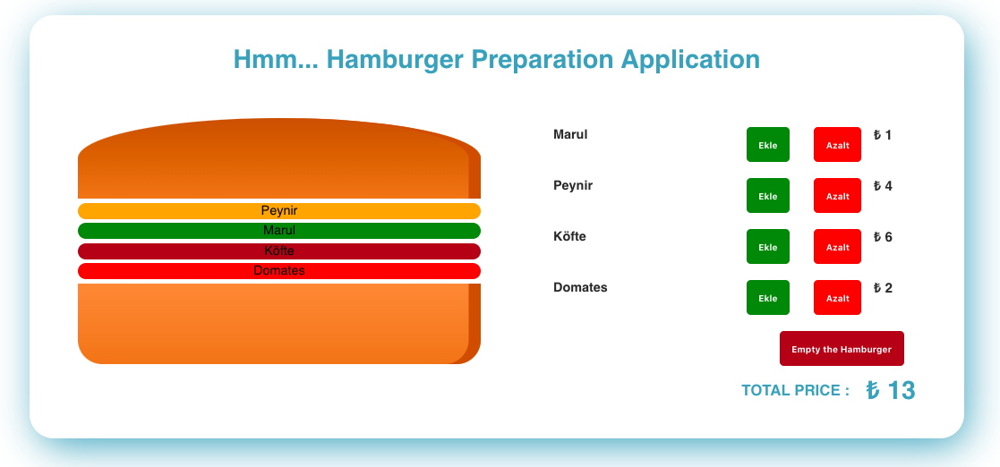
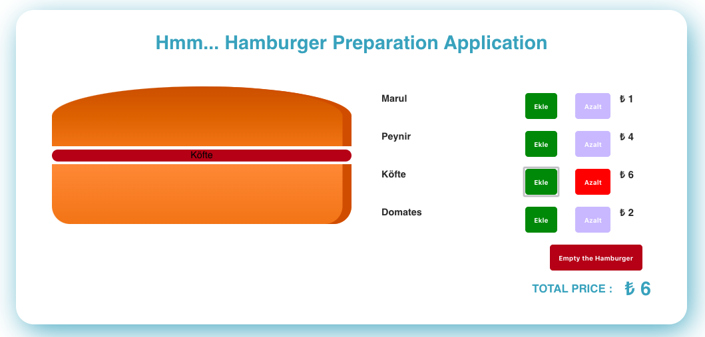

# React.js with Hamburger Preparation Application 
# Getting Started
Hmm... Hamburger Preparation Application based on React basics

## Run The Project
```python
$ npm install

$ npm run start 
or 
$ yarn start
```
# Sample Picture from the Project


